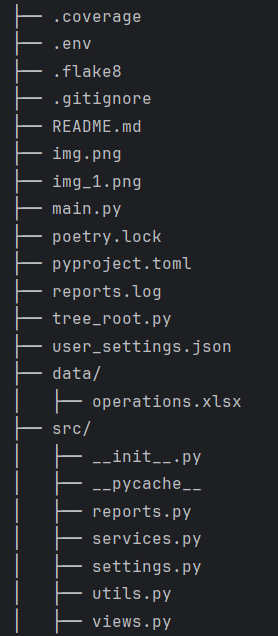
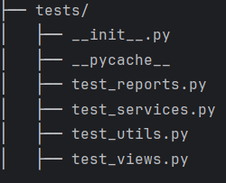
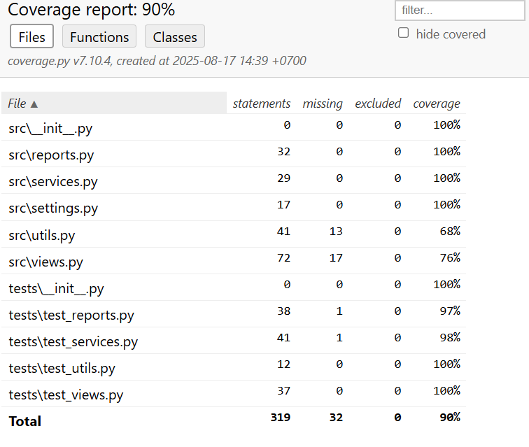

# Финансовый помощник (Python)

Этот проект — небольшое приложение, которое:
- Загружает ваши банковские транзакции из Excel
- Нормализует данные (даты, суммы, категории)
- Готовит "события" (важные операции)
- Показывает главную страницу со сводкой:
  - приветствие (утро/день/вечер/ночь),
  - курсы валют (через API),
  - акции (через API),
  - карты и расходы,
  - топ-транзакции.

---

## 📂 Структура проекта





---

## 🚀 Установка и запуск

1. Убедитесь, что установлен **Python 3.9+**  
   Проверить:
   ```bash
   python --version
   
2. Клонируйте проект или скачайте архив:
```bash
git clone https://github.com/korklin/Cours_project_1.git

cd finance-helper
```
3. Создайте виртуальное окружение (рекомендуется):
```bash
python -m venv venv
source venv/bin/activate   # Linux / macOS
venv\Scripts\activate      # Windows
```
4. Установите зависимости:
```bash
pip install -r requirements.txt
```
5. Запустите приложение:
```bash
python main.py
```
## Основные файлы

- main.py
Точка входа. Отсюда запускаются функции для отображения страниц.

- src/views.py
"Вид" приложения. Здесь есть:

- get_main_page() → главная страница (валюты, акции, приветствие, карты, топ транзакции)

- get_events_page() → список событий на основе транзакций

- src/utils.py

    Вспомогательные функции:

  - load_transactions(filepath) → загрузка транзакций из Excel

  - normalize_transactions(df) → подготовка данных

  - prepare_events(df) → создание списка событий

- data/operations.xlsx
Пример файла с операциями (вы можете подставить свой).

- tests/
Автоматические тесты на pytest, чтобы убедиться, что всё работает.

## 🔑 API-ключи

Проект использует сторонние API:

apilayer.com — для курсов валют

alphavantage.co — для акций

Ключи хранятся в переменных: CURRENCY_API_KEY, STOCK_API_KEY

## ✅ Тесты

Для запуска тестов:
```bash
pytest
```

## Информация о покрытии кода тестами:


## Документация:

Для получения той же самой информации обратитесь к [ЭТОЙ документации](docs/README.md).

## Лицензия:

Этот проект еще не лицензирован.
